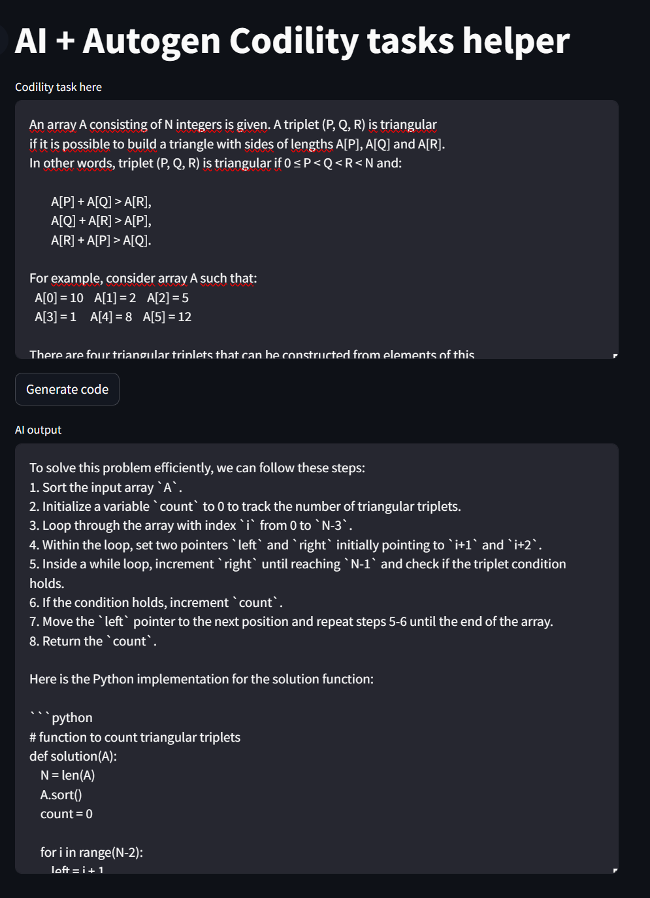

# AI + Autogen Codility tasks helper

A tool created to automate Codility tasks. Solve tasks using AI + Microsoft Autogen. Tested with GPT-3.5

The tool generates code with use ChatGPT, next generated code is executed in separate docker container.  
If there are no errors, AI response is returned.  
If there is an error then tool generates code again (2 tries).

- [Requirements](#requirements)
- [Details](#details)
- [Run](#run)
  - [Run as docker container](#run-as-docker-container)
  - [Run from source](#run-from-source)


## Requirements
- Python 3.10+
- Docker >=  24.0.5
- docker-compose >= 2.23.3

## Details

There are 3 agents:

1) Assistant Agent - general agent to collaborate with others, powered by AI
2) Code Writer Agent - agent used to create code based on a task message from the user
3) Code executor agent - agent used to execute code created by code writer agent and return results, just Python executor, not powered by AI

Agents are connected to a group. Group is managed by Group Manager object

Agents flow:
- Task content from User -> Assistant Agent -> Code Writer Agent -> Code Executor Agent
- If code generated by code writer agent returns an error (exitcode: 1 in execution results), code writer agent is called again (2 tries)
- AI response is returned

Dockerhub image: https://hub.docker.com/repository/docker/wojtek9502/autogen-codility-tasks  
WebUI created using Streamlit: https://streamlit.io/  
Microsoft Autogen: https://microsoft.github.io/autogen/docs/Getting-Started/ 

Sample task: https://app.codility.com/programmers/lessons/15-caterpillar_method/count_triangles/


WebUI Screen:


## Run
```
This project executes code generated by AI!.
If you are running this project from source, set USE_DOCKER_CODE_EXECUTOR env to 1, to run AI-generated code 
in a separate Docker container (install Docker first). 

You can set this value to 0 to run AI generated code on your local machine at your own risk.

If you are running this project as a docker container, there is no point in creating another one.
In this case, set USE_DOCKER_CODE_EXECUTOR to 0.
```
### Run as docker container
1) Create docker-compose.yml file:
```yaml
version: '3.6'
services:
  webgui:
    image: 'wojtek9502/autogen-codility-tasks'
    command: ['python', 'run_webgui.py']
    environment:
      - OPENAI_API_KEY=<your_api_key>
      - USE_DOCKER_CODE_EXECUTOR=0
      - OPENAI_API_KEY=gpt-3.5-turbo
    ports:
      - '8080:8501'
```
2) Run:
```shell
docker compose up --build
```
3) Go to http://127.0.0.1:8080


### Run from source
1) Install venv and activate:
```shell
python -m pip install virtualenv
make install-venv
make install
source venv/bin/activate
```
2) Create .env file in main dir. See .env.example
```
OPENAI_API_KEY=<your openai key>
USE_DOCKER_CODE_EXECUTOR=1    # When you run this from source, execute code generated by AI inside docker container
```
3) Run containers
```shell
make recreate
````
4) Go to http://127.0.0.1:8080

